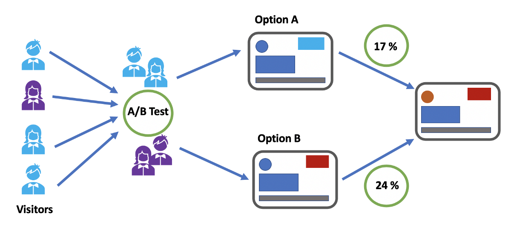

# A/B testing

 
 

 

Comparison tests
Comparison tests look for differences among group means. They can be used to test the effect of a categorical variable on the mean value of some other characteristic.

T-tests are used when comparing the means of precisely two groups (e.g. the average heights of men and women). ANOVA and MANOVA tests are used when comparing the means of more than two groups (e.g. the average heights of children, teenagers, and adults).

|Test  |	Predictor variable	|Outcome variable	| Research question example|
|------|----------------------|-----------------|--------------------------|
|Paired t-test | <ul><li>Categorical</li> <li>1 predictor</li></ul>| <ul><li>Quantitative</li> <li>groups come from the same population</li></ul>|<ul><li>What is the effect of two different test prep programs on the average exam scores for students from the same class?</li></ul>|
|Independent t-test	| <ul><li>Categorical</li><li>1 predictor</li></ul> | <ul><li>Quantitative</li><li>groups come from different populations</ul>|<ul><li>What is the difference in average exam scores for students from two different schools?</li></ul>|
|ANOVA	| <ul><li>Categorical</li><li>1 or more predictor</li></ul>| <ul><li>Quantitative</li><li>1 outcome</li><ul> |<ul><li>What is the difference in average pain levels among post-surgical patients given three different painkillers?</ul></li>|
  |MANOVA	|<ul><li>Categorical</li><li>1 or more predictor</li></ul>| <ul><li>Quantitative</li><li>2 or more outcome</li></ul>|<ul><li>What is the effect of flower species on petal length, petal width, and stem length?</li></ul>|

[View code](https://nbviewer.jupyter.org/github/reejungkim/AB_testing/blob/main/ab%20testing.ipynb)
